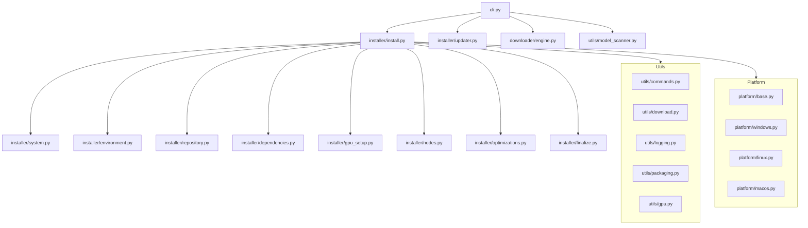

# Architecture

## Three-Layer Architecture

The installer uses a **bootstrap + two-phase** architecture:

| Layer | File | Purpose |
|-------|------|---------|
| **Bootstrap** | `Install.bat` / `Install.sh` | Downloads `uv`, creates venv with Python 3.11–3.13, installs CLI |
| **Phase 1** | `src/installer/phase1.py` | System checks, venv/conda setup, tool installs (aria2, git) |
| **Phase 2** | `src/installer/phase2.py` | ComfyUI clone, junctions, pip packages, custom nodes, launchers |

## Junction-Based Data Separation

User data (models, outputs, custom nodes) lives in **external folders**, linked into ComfyUI via junctions/symlinks. This allows `git pull` updates without data loss.

```
install_path/
├── scripts/venv/            # Python virtual environment
├── ComfyUI/                 # Git repo (can be wiped for updates)
│   ├── models/ → ../models  # ← junction (symlink)
│   ├── output/ → ../output  # ← junction
│   └── main.py
├── models/                  # ← User data (persists)
├── output/                  # ← User data (persists)
├── logs/                    # Install and update logs
└── UmeAiRT-Start-ComfyUI.bat
```

## Module Overview



## Configuration

All dependencies and URLs live in `scripts/dependencies.json`, validated by Pydantic models in [`src/config.py`](api/config.md).

Custom nodes are managed via `scripts/custom_nodes.json` using an **additive-only** manifest: the installer never removes user-installed nodes.
