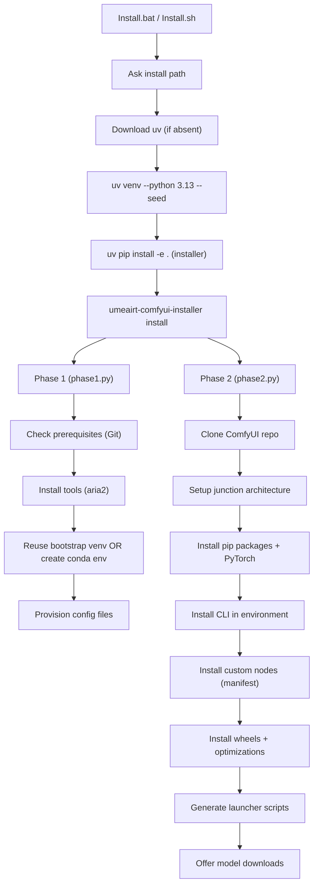

# Project Structure Map

## High-Level Anatomy

| Directory/File | Description |
|----------------|-------------|
| `Install.bat` / `Install.sh` | **USER ENTRY POINT**. Zero-dependency bootstrap: downloads `uv`, creates venv, asks install path. |
| `src/` | **CORE LOGIC**. All Python source code. |
| `scripts/` | **CONFIGURATION**. JSON configs, manifests, and data files. |
| `tests/` | pytest test suite. |
| `docs/codemaps/` | Internal architectural documentation. |
| `.cursorrules` | AI Agent compact instructions. |
| `AGENTS.md` | Full developer guide for AI Agents. |

## Source Code (`src/`)

```
src/
├── __init__.py              # Version (__version__)
├── cli.py                   # Typer CLI (install, update, download-models, info)
├── config.py                # Pydantic config models (DependenciesConfig, InstallerSettings)
├── installer/
│   ├── phase1.py            # System checks, Python, venv/conda, tools
│   ├── phase2.py            # ComfyUI clone, nodes, packages, lanceurs
│   ├── updater.py           # Update logic (git pull, node updates)
│   └── nodes.py             # Additive node manifest system
├── utils/
│   ├── logging.py           # InstallerLogger with step counter
│   ├── commands.py          # run_and_log(), check_command_exists()
│   ├── download.py          # Download with aria2c fallback
│   └── gpu.py               # GPU detection, VRAM info
├── platform/
│   ├── base.py              # Abstract platform + factory
│   └── windows.py           # Windows-specific implementations
└── downloader/
    └── engine.py            # Model catalog download system
```

## Configuration Files (`scripts/`)

| File | Purpose |
|------|---------|
| `dependencies.json` | All URLs, packages, tools — validated by Pydantic |
| `custom_nodes.json` | Additive node manifest (name, url, requirements) |
| `nunchaku_versions.json` | Version matrix for nunchaku node |
| `environment.yml` | Conda environment spec (conda mode only) |
| `comfy.settings.json` | Default ComfyUI user settings |

## Installation Flow



## CLI Commands

| Command | Purpose |
|---------|---------|
| `umeairt-comfyui-installer install` | Full installation (Phase 1 + Phase 2) |
| `umeairt-comfyui-installer update` | Update ComfyUI, nodes, and dependencies |
| `umeairt-comfyui-installer download-models` | Interactive model pack downloads |
| `umeairt-comfyui-installer info` | Display system info (GPU, Python, tools) |
| `umeairt-comfyui-installer version` | Show installer version |

## Generated Launcher Scripts

At install time, `phase2.py` generates these in the install directory:

| Script | Purpose |
|--------|---------|
| `UmeAiRT-Start-ComfyUI.bat/.sh` | Performance mode (SageAttention) |
| `UmeAiRT-Start-ComfyUI_LowVRAM.bat/.sh` | Low VRAM mode |
| `UmeAiRT-Download-Models.bat/.sh` | Re-launch model download menu |
| `UmeAiRT-Update.bat/.sh` | Run the update process |
